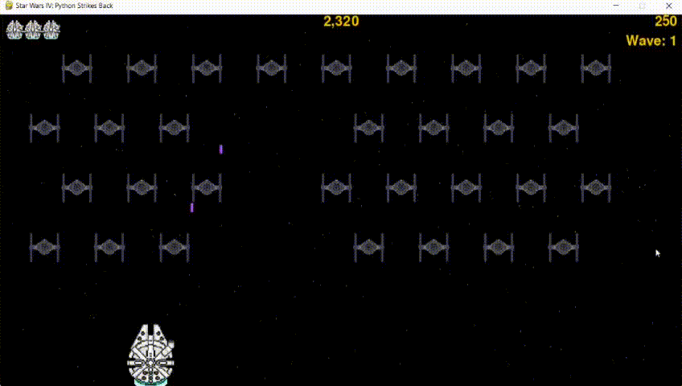

<h1 align="center">Star Wars IV: Python Strikes Back</h1>
<p align="center"><i>Take a look at the <a href="https://www.youtube.com/watch?v=-mpaHcAdJ-U">Gameplay</a></i></p>
<p align="center">
<a href="https://github.com/RaulMaya/Star-Wars-Game">
  
</a>
</p>

## About This Project :page_facing_up:

A long time ago in a galaxy far, far away, the Millennium Falcon is fighting Imperial TIE-Fighters. The Millennium Falcon can move in right, left, up and down directions using the arrow keys and shoot rockets by pressing the space bar. When the game begins, a group of TIE-Fighters will fill the sky. The user shoots and destroys the TIE-Fighters. If the user shoots all the TIE-Fighters, a new fleet will appear, that moves faster than the last one. If any TIE-Fighter hits the player ship or reaches the bottom, the user will lose a life. If the user loses three lives, the game will be over.

## Quick Gameplay :video_game:



## Starting


#### Installation

1. Clone the repository
```sh
git clone https://github.com/RaulMaya/Star-Wars-Game.git
```

2. Necessary Modules

- These are the modules that you need to install in the environment where you want to run the game. Run in your terminal the following commands.

- pygame
```sh
python -m pip install --user pygame
```
<p><i>If the command doesn't work, try running again the command but without the --user flag</i></p>

- random
```sh
pip install random
```

3. Run the app
```sh
python star_wars_game.py
```

## Controls


* `Arrow-Up:` Moves the Millenium Falcom Up
* `Arrow-Down:` Moves the Millenium Falcom Down
* `Arrow-Left:` Moves the Millenium Falcom Left
* `Arrow-Right:` Moves the Millenium Falcom Right
* `Spacebar:` Shoots rockets -
* `P Key:` Pause the game
* `S Key:` Start a new game (in the main menu)
* `Q Key:` Quit the game


## Contact :iphone:

* Name: Raul Maya Salazar
* Phone: +52 833 159 7006
* E-mail: raulmayas20@gmail.com
* GitHub: https://github.com/RaulMaya
* LinkedIn: https://www.linkedin.com/in/raul-maya/

## Credits :raised_hands:
- <a href="https://www.amazon.com.mx/Python-Crash-Course-Eric-Matthes/dp/1593279280/ref=sr_1_1?crid=1NXA3FY0WI62R&keywords=python+crash+course&qid=1644954661&sprefix=python+crash%2Caps%2C608&sr=8-1
">Book: Python Crash Course: A Hands-On, Project-Based Introduction to Programming by Eric Matthes.</a>
