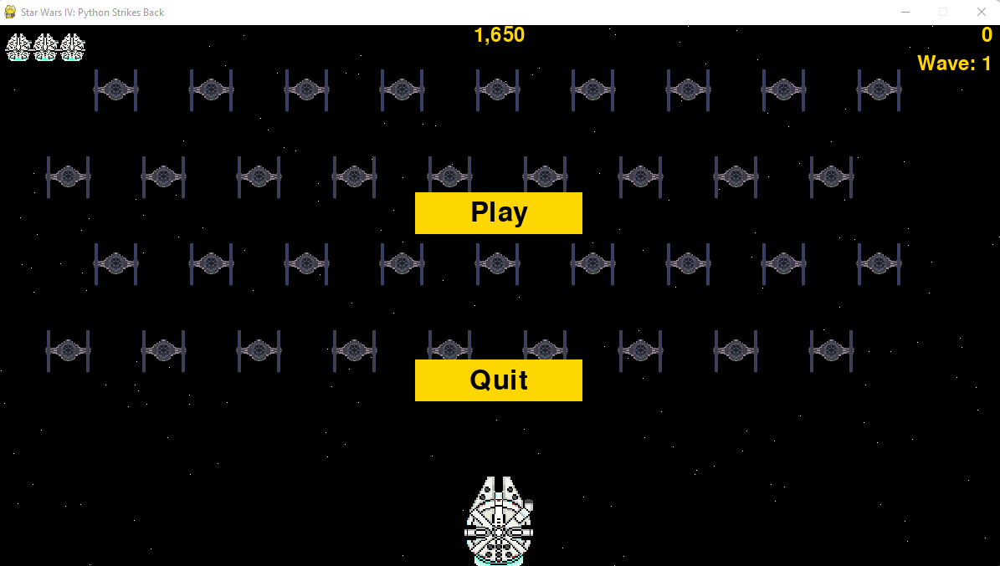
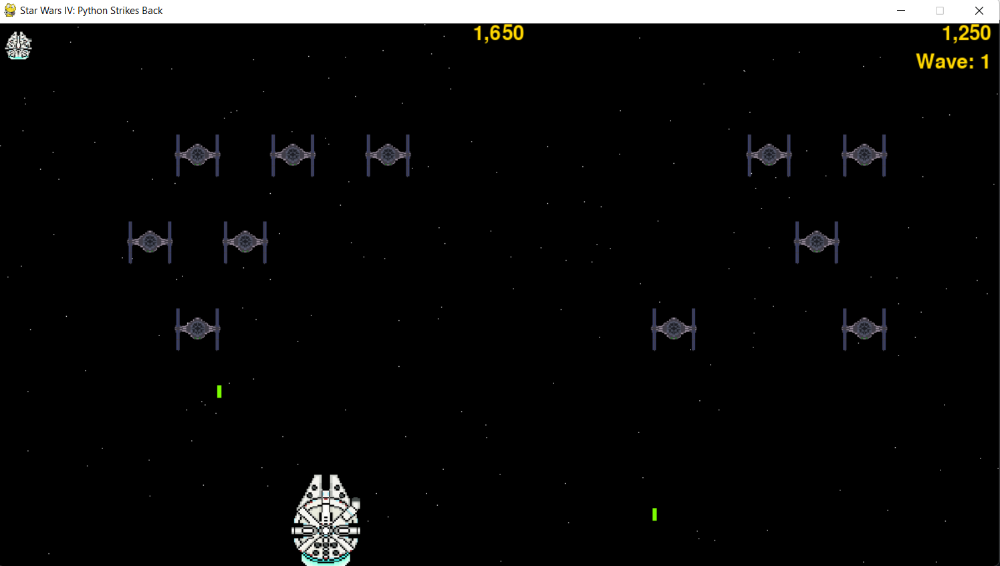

# <b>Star Wars IV: Python Strikes Back </b>

### Introduction

A long time ago in a galaxy far far away, the Millenium Falcon is fighting Imperial TIE-Fighters. The Millenium Falcon can move in right, left, up and down directions using the arrow keys and shoot rockets by pressing the spacebar. When the game begins, a group of TIE-Fighters will fill the sky. The user shoots and destroys the TIE-Fighters. If the user shoots all the TIE-Fighters, a new fleet will appear, that moves faster than the last one. If any TIE-Fighter hits the player ship or reaches the bottom, the user will lose a life. If the user loses three lifes, the game will be over.

### Controls

* <b>Arrow-Up:</b> Moves the Millenium Falcom Up
* <b>Arrow-Down:</b> Moves the Millenium Falcom Down
* <b>Arrow-Left:</b> Moves the Millenium Falcom Left
* <b>Arrow-Right:</b> Moves the Millenium Falcom Right
* <b>Spacebar:</b> Shoots rockets
* <b>P Key:</b> Pause the game
* <b>S Key:</b> Start a new game (in the main menu)
* <b>Q Key:</b> Quit the game

### Main Menu

### Gameplay

### Contact

* Name: Raul Maya Salazar
* Phone: +52 833 159 7006
* E-mail: raulmayas20@gmail.com
* GitHub: https://github.com/RaulMaya
* LinkedIn: https://www.linkedin.com/in/raul-maya/
